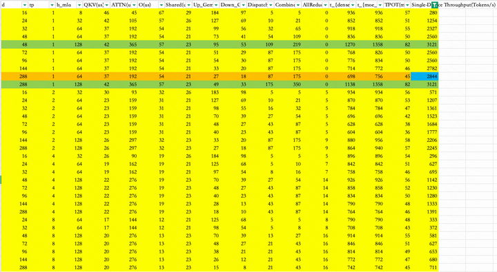
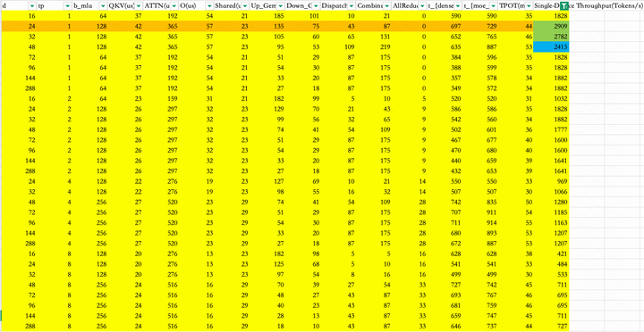
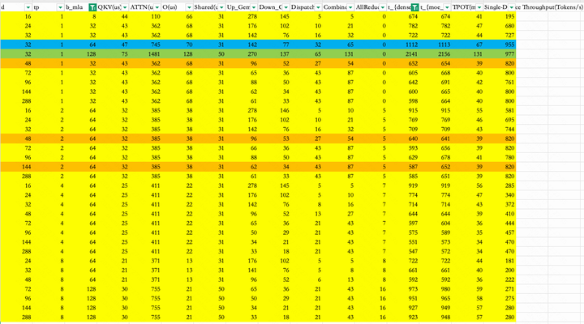

# DeepSeek Simulator

This is a simulator to mimic the possible performance of DeepSeek V3/R1 at different Hopper hardwares. Other hardware should provide Gemm/MLA kernels to adapt to this tool.

## Installation

### Requirements
Follow DeepGemm, it requires:
- Hopper architecture GPUs, sm_90a must be supported
- Python 3.8 or above
- CUDA 12.3 or above
- PyTorch 2.1 or above
- CUTLASS 3.6 or above (could be cloned by Git submodule)

```bash
# omit install torch

# install FlashMLA
git clone  --recursive https://github.com/deepseek-ai/FlashMLA.git
python setup.py install

# install DeepGemm
git clone --recursive https://github.com/deepseek-ai/DeepGEMM.git
python setup.py install

```
## Features
### Hardware Supported
- H800 80G(tested)
- H20 96G(tested)
- Other Hopper architectures should be working

### Parallel Method：
- Attention DP ,  MoE EP
- Attention TP+DP, MoE EP
  
### Overlap Method：
- two-mircobatch overlapping （DeepSeek Official）
- single-batch compute-communication overlapping

## Results
### H800
- H800 80G with two-mircobatch overlapping
  

- H800 80G with single-batch compute-communication overlapping
    

### H20
- H20 96G with two-mircobatch overlapping
  
- H20 96G with single-batch compute-communication overlapping
  

## License
This code repository is released under the [MIT License](./LICENCE).

## Citation
```bibtex
@misc{deepseek_simulator,
      title={DeepSeek-Simulator: A test-based Performance Simulator for DeepSeek V3/R1}, 
      author={Han Shen},
      year={2025},
      publisher = {GitHub},
      howpublished = {\url{https://github.com/shenh10/DeepSeek_Simulator.git}},
}
```